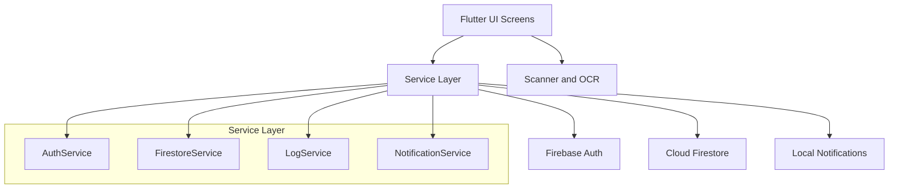
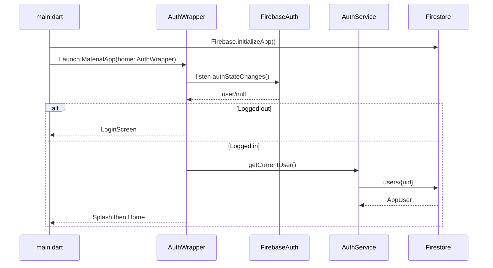

# Architecture

## 1. System Summary
Karam Stock is a Flutter Android inventory app with Firebase Authentication and Cloud Firestore.

Core capabilities:
- Role-based access (`superadmin`, `admin`, `user`)
- Multi-tenant inventory partitioning by `adminUid`
- Inventory lifecycle (add, edit, move, delete, restore, permanent delete)
- User and permissions management
- Import/export workflows (Excel/PDF)
- Activity logs and local device notifications

## 2. High-Level Architecture


## 3. Runtime Session Flow


## 4. Layered Module Map

### Presentation Layer (`lib/*_screen.dart`)
- `main.dart`: app root, menu navigation, home dashboard
- `auth_wrapper.dart`: auth-state driven routing and splash orchestration
- `login_screen.dart`: login UI and validation
- `inventory_screen.dart`: inventory list/filter/sort/view
- `scanner_screen.dart`: barcode + OCR capture and add-item flow
- `users_screen.dart`: admin user management
- `super_admin_screen.dart`: global oversight and logs view
- `import_screen.dart`: Excel/PDF import pipeline
- `deleted_items_screen.dart`: restore/permanent delete/export
- `manage_screen.dart`: warehouse/product list management
- `migration_screen.dart`: SQLite to Firestore migration

### Domain/Service Layer
- `auth_service.dart`: auth, role/profile, account creation, role mutation
- `firestore_service.dart`: inventory/deleted/products/warehouses CRUD + stats + migration
- `log_service.dart`: daily activity log write/read/cleanup
- `notification_service.dart`: Firestore-backed admin notifications + local notification display
- `export_helper.dart`: Excel export and share

### Data Layer
- Firestore (primary online data store)
- Firebase Auth (identity)
- SQLite legacy (`database.dart`) for migration source

### Platform Layer
- Android Gradle and manifest files in `android/`
- Firebase app configuration (`google-services.json`, `firebase_options.dart`)

## 5. Tenant Isolation Model
```mermaid
flowchart LR
  U[AppUser] --> R{Role}
  R -->|admin/superadmin| AUID[user.uid]
  R -->|user| AUID2[user.adminUid]

  AUID --> INV[inventory/{adminUid}/...]
  AUID2 --> INV
```

Notes:
- All inventory domain reads/writes resolve through `FirestoreService._getAdminUid()`.
- Admins use their own `uid` as partition key.
- Users use their assigned `adminUid` partition.

## 6. Primary Data Domains
- Identity: `users/{uid}`
- Inventory domain: `inventory/{adminUid}/items|deleted_items|warehouses|products`
- Notifications: `notifications/{uid}/items`
- Logs: `activity_logs/{YYYY-MM-DD}/events/{eventId}`

## 7. Cross-Cutting Concerns
- Audit logging is called from inventory/auth/user management flows through `LogService`.
- Permission checks are enforced in UI (capability flags) and expected to be enforced in Firestore Rules.
- Notification fan-out is done by writing Firestore docs, then local notifications display on listeners.

## 8. Known Architectural Constraints
- Firestore Rules currently include a broad fallback (`match /{document=**}`) that should be tightened for production.
- Notification fan-out is client-side; server-side Cloud Functions would be more secure for strict environments.
- `test/widget_test.dart` is template-based and not aligned with current app architecture.
